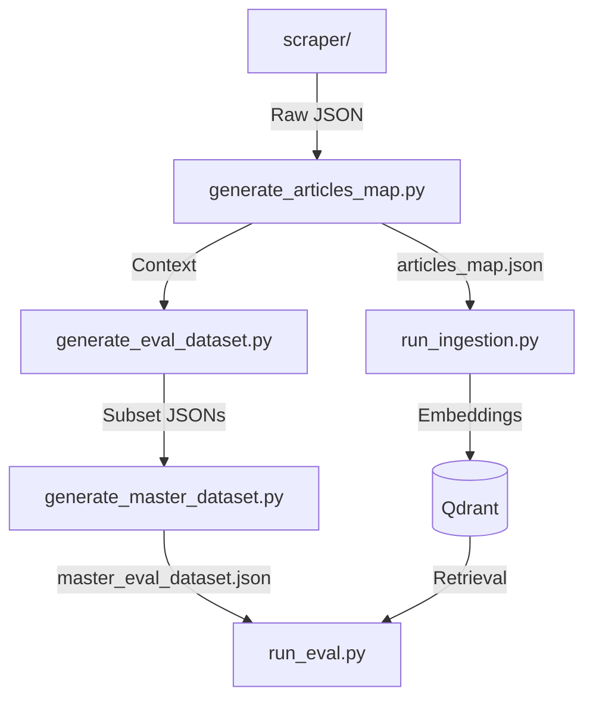

# CLAUDE.md

This file provides guidance to Claude Code (claude.ai/code) when working with code in this repository.

## Project Overview

**Labor Law Guardian (LexLab-X)** is a staged RAG (Retrieval-Augmented Generation) system for Taiwan labor law, built with a modular architecture using Strategy + Factory design patterns. The project supports multiple RAG versions running concurrently for experimentation and evaluation.

## Technology Stack

- **Python**: 3.12+ (managed by `uv`)
- **RAG Framework**: LlamaIndex, LangChain
- **Vector Database**: Qdrant (containerized)
- **Embedding Model**: BAAI/bge-m3
- **LLMs**: OpenAI, Anthropic Claude, Google Gemini
- **API**: FastAPI (planned for Week 6+)
- **Frontend**: Next.js (planned for Week 6-7)

## Critical Rules

### 1. Dependency Management (MANDATORY)

**ALWAYS use `uv` for all Python operations:**

```bash
# Run scripts
uv run python backend/scripts/run_eval.py --rag-version 0.0.3

# Add dependencies (REQUIRES USER APPROVAL FIRST)
uv add <package_name>

# Remove dependencies (REQUIRES USER APPROVAL FIRST)
uv remove <package_name>
```

**NEVER use `pip`, `conda`, or `poetry` directly.** All dependencies must be in the project's local `.venv` managed by `uv`.

**Dependency Authorization Protocol:**
- Before adding/removing/updating dependencies, you MUST:
  1. Explain why the dependency is needed
  2. Explicitly ask for user consent
  3. Wait for approval before executing

### 2. Language Policy

**Repository Files** (code, READMEs, comments, documentation):
- All files in the repository MUST be written in **English only**
- This includes: code, docstrings, comments, README files, commit messages

**Internal Communication** (Claude Code ↔ User):
- Artifacts for internal communication (Tasks, Implementation Plans, Technical Walkthroughs) should be in **Traditional Chinese (zh-TW)**
- Technical terms must remain in **English** (e.g., "RAG", "Vector Database", "Embedding")

### 3. Folder Documentation

- **Every major directory MUST have a `README.md`**
- READMEs must include:
  1. Folder responsibility
  2. File manifest (what each file does)
  3. Architecture & design patterns
  4. Extension guidelines
- **Documentation updates are part of "Definition of Done"** - update READMEs simultaneously with code changes

## Common Commands

### Environment Setup

```bash
# Start Qdrant vector database
docker-compose up -d

# Verify Qdrant is running
curl http://localhost:6333/collections

# Create .env from template
cp .env.example .env
# Then add your OPENAI_API_KEY
```

### RAG Pipeline Operations

```bash
# Run ingestion (index documents into Qdrant)
uv run python backend/scripts/run_ingestion.py --rag-version 0.0.3

# Dry-run ingestion (generate intermediate files only)
uv run python backend/scripts/run_ingestion.py --rag-version 0.0.3 --dry-run

# Run retrieval evaluation
uv run python backend/scripts/run_eval.py --rag-version 0.0.3

# Generate JSON log and text report
uv run python backend/scripts/run_eval.py --rag-version 0.0.3 --json --report

# Test single query
uv run python backend/scripts/run_eval.py --query "勞工加班費如何計算？"

# Filter by tags
uv run python backend/scripts/run_eval.py --incl-tag level1 --excl-tag edge_case
```

### Dataset Management

```bash
# Generate evaluation dataset from raw legal texts
uv run python backend/scripts/generate_eval_dataset.py

# Merge subset into master dataset
uv run python backend/scripts/generate_master_dataset.py

# Generate articles lookup map
uv run python backend/scripts/generate_articles_map.py
```

### Testing & Type Checking

```bash
# Run all tests
uv run python -m pytest backend/tests/

# Run specific test
uv run python -m pytest backend/tests/test_law_article_chunker.py

# Type check with mypy
uv run mypy backend/app/
```

## Architecture Overview

### RAG Strategy Pattern

The codebase uses **Strategy + Factory** patterns to support multiple RAG versions:

```python
# Factory creates the appropriate strategy based on version string
from backend.app.rag.factory import get_retriever_strategy, get_ingestion_strategy

# Get retriever for version 0.0.3
retriever = get_retriever_strategy("0.0.3")
nodes = retriever.retrieve("query")

# Get ingestion strategy
ingestion = get_ingestion_strategy("0.0.3")
ingestion.run(documents)
```

**Supported RAG Versions:**

| Version | Description | Ingestion Strategy | Retrieval Strategy |
|---------|-------------|-------------------|-------------------|
| 0.0.1 | Naive/Baseline | Raw full articles | Simple Top-K vector search |
| 0.0.2 | Parent-Child Fine | Recursive splits (Article → Para → Subpara) | Diversity retriever with dedup |
| 0.0.3 | Parent-Child Coarse | Numeric paragraph splits | Diversity retriever with dedup |

### Project Structure

```
backend/
├── app/                        # Main application code
│   ├── rag/                    # RAG module (Strategy + Factory architecture)
│   │   ├── interface.py        # Strategy interfaces (RetrieverStrategy, IngestionStrategy)
│   │   ├── factory.py          # Factory to instantiate strategies
│   │   ├── types.py            # Enums (RagVersion)
│   │   ├── config.py           # Configuration (paths, constants)
│   │   └── core/               # Pure library logic (no CLI dependencies)
│   │       ├── common.py       # Shared setup (LlamaIndex settings)
│   │       ├── ingestion/      # IngestionStrategy implementations
│   │       │   ├── naive_ingestion.py
│   │       │   ├── parent_child_ingestion.py
│   │       │   └── components/ # Reusable components (chunker, loaders)
│   │       ├── retrieval/      # RetrieverStrategy implementations
│   │       │   ├── naive_retrieval.py
│   │       │   ├── parent_child_retrieval.py
│   │       │   ├── components.py  # DiversityRetriever
│   │       │   └── postprocessors.py
│   │       └── evaluation/     # Evaluation logic
│   │           ├── evaluator.py   # RetrieverEvaluator
│   │           └── reporting.py   # Report generation
│   ├── agents/                 # Agent workflows (LangGraph)
│   ├── api/                    # FastAPI routes (Week 6+)
│   └── prompt_manager.py       # Centralized prompt registry
├── prompts/                    # .prompty files (Jinja2 + Frontmatter)
│   └── manifest.json           # Prompt registry mapping
├── scripts/                    # CLI scripts for pipelines
│   ├── run_eval.py             # Evaluation runner
│   ├── run_ingestion.py        # Ingestion runner
│   ├── generate_eval_dataset.py
│   ├── generate_master_dataset.py
│   └── scraper/                # Data collection scripts
├── data/                       # Local data artifacts
│   ├── law_data/
│   │   ├── raw_law_data/       # Raw JSON from scraper
│   │   └── parent_child_index/ # Intermediate chunked data
│   └── eval_dataset/           # Evaluation datasets
│       ├── subset/             # Generated subsets
│       └── master_eval_dataset.json
└── tests/                      # Unit tests

qdrant_data/                    # Qdrant storage (Docker volume)
```

### Data Pipeline Flow



### Key Concepts

**1. Strategy Interface** (`backend/app/rag/interface.py`):
- `RetrieverStrategy`: Defines `retrieve()` and `get_retrieved_article_id()` methods
- `IngestionStrategy`: Defines `run()` method for indexing

**2. Factory** (`backend/app/rag/factory.py`):
- `get_retriever_strategy(version: str)` → Returns configured strategy instance
- `get_ingestion_strategy(version: str)` → Returns configured strategy instance

**3. Evaluation**:
- Uses `RetrieverEvaluator` with polymorphic strategy
- Metrics: MAP@K, MRR@K, Recall@K, Precision@K
- Ground truth comparison uses `strategy.get_retrieved_article_id()` for version-specific logic

**4. Prompt Management**:
- Prompts stored as `.prompty` files (Jinja2 templates with YAML frontmatter)
- Registry in `backend/prompts/manifest.json` maps task names to file paths
- Supports dev/prod versions per task

```python
from backend.app.prompt_manager import PromptRegistry

registry = PromptRegistry()
prompt = registry.get_prompt("task_name")  # Returns LangChain Runnable
chain = prompt | model
```

## Adding New RAG Versions

1. Define new enum in `backend/app/rag/types.py::RagVersion`
2. Implement new strategy class in `backend/app/rag/core/ingestion/` or `core/retrieval/`
3. Register in `backend/app/rag/factory.py`
4. Update version mapping in `backend/app/rag/config.py`

## Development Workflow

1. **Start Dependencies**: `docker-compose up -d` (Qdrant)
2. **Ingest Data**: `uv run python backend/scripts/run_ingestion.py --rag-version 0.0.3`
3. **Evaluate**: `uv run python backend/scripts/run_eval.py --rag-version 0.0.3 --report`
4. **Iterate**: Modify strategy → re-ingest → re-evaluate

## Important Notes

- **Qdrant Collections**: Named by RAG version (e.g., `labor_law_v0_0_3`)
- **Intermediate Files**: Parent-Child strategies generate JSON in `backend/data/law_data/parent_child_index/`
- **Evaluation Reports**: Saved to `backend/app/rag/evals/reports/`
- **Scripts use argparse**: All scripts support `-h` for help
- **Path Resolution**: Scripts use `PROJECT_ROOT` to ensure imports work from any directory

## Current Project Status

Based on git history:
- ✅ Week 1-2: Scraper, schema, Qdrant integration, RAG v0.0.1-0.0.3
- ✅ Evaluation pipeline with MAP@k, MRR@k metrics
- ✅ Strategy + Factory architecture implemented
- 🚧 Week 3-4: Agent workflows (in progress)
- ⏳ Week 6-7: API + Frontend (planned)
