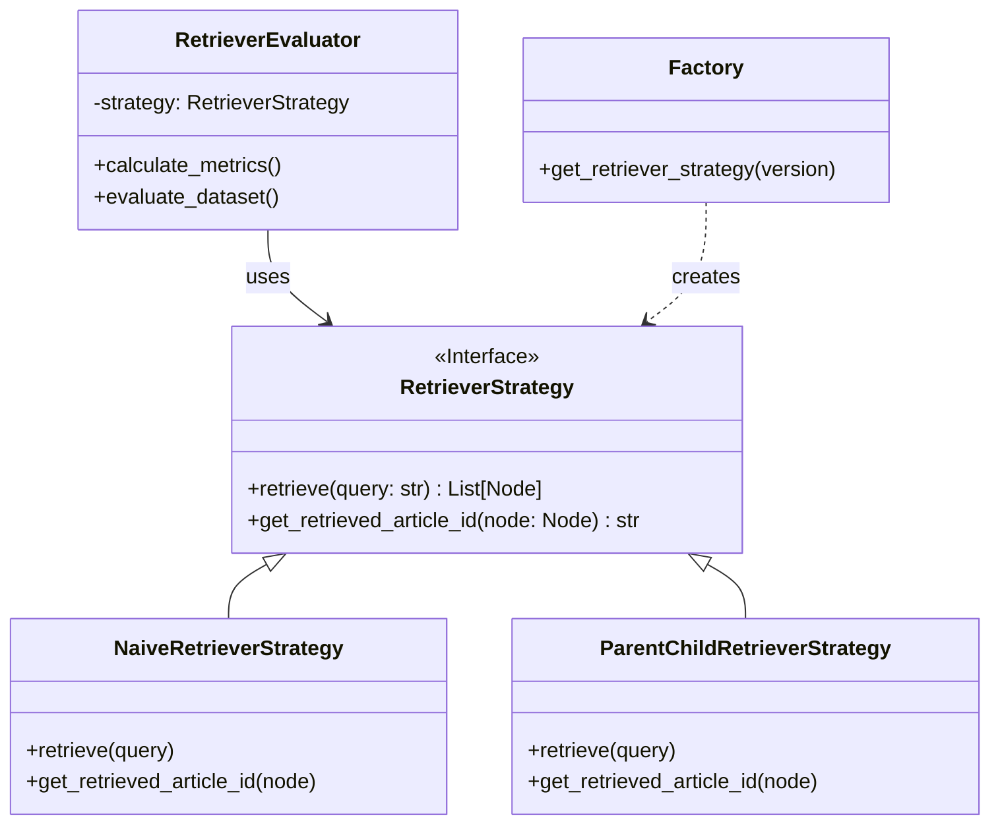

# RAG Module Architecture

The `backend/app/rag` module implements a modular Retrieval-Augmented Generation pipeline using the **Strategy** and **Factory** patterns. This design decouples the core logic from execution scripts and supports multiple RAG modifications (versions) concurrently.

## Architecture Overview

We use the **Strategy Pattern** to encapsulate the behavior of different RAG versions (e.g., Naive vs. Parent-Child) behind a common interface. The **Factory Pattern** handles the instant.

### UML Class Diagram



### Code Flow Demonstration

The following snippet illustrates the flow from the Application Layer (Script) to the Core Logic (Strategy).

```python
# 1. Application Layer (backend/scripts/run_eval.py)
# User runs: python backend/scripts/run_eval.py --rag-version 0.0.3

from backend.app.rag.factory import get_retriever_strategy

# Step A: Ask Factory for the correct object based on a simple string
version_str = "0.0.3"
strategy = get_retriever_strategy(version_str)
# -> returns instance of ParentChildRetrieverStrategy(version="0.0.3")

# Step B: Pass strategy to the Evaluator (Client)
evaluator = RetrieverEvaluator(strategy=strategy, ...)

# Step C: The Client uses the Strategy Interface
# The Evaluator doesn't know it's using the "ParentChild" version.
nodes = evaluator.run_retrieval("Query")
# -> internally calls strategy.retrieve("Query")

# Step D: Polymorphism in Action
for node in nodes:
    # Evaluator asks: "What is the comparison key for this node?"
    # Naive Strategy would return: node.metadata['article_id']
    # ParentChild Strategy returns: node.metadata['parent_id']
    key = strategy.get_retrieved_article_id(node)
```

## Directory Structure

```text
backend/app/rag/
├── interface.py          # [Contract] Defines the Strategy Interfaces (Retriever & Ingestion)
├── factory.py            # [Assembly] Factory to instantiate strategies based on version string
├── types.py              # [Types] Core Enums including RagVersion
├── config.py             # [Config] Configuration (paths, model names, constants)
├── core/                 # [Library] Pure implementation logic (No CLI/IO dependencies)
│   ├── common.py         # Shared setup (e.g., LlamaIndex settings)
│   ├── retrieval/        # Concrete implementations of RetrieverStrategy
│   └── evaluation/       # Logic for evaluating retrieval performance
└── scripts/              # [DEPRECATED] Scripts have been moved to backend/scripts/
```

## Core Concepts

### 1. Strategy Pattern (`interface.py`)

We define strict interfaces that all versions must adhere to. This allows the Evaluator and API to switch between versions seamlessly.

- **`RetrieverStrategy`**:
  - `retrieve(query: str) -> List[Node]`: Return relevant nodes.
  - `get_retrieved_article_id(node: Node) -> str`: Extract the comparison key (Article ID) for evaluation ground truth matching.

### 2. Factory Pattern (`factory.py`)

The `get_retriever_strategy(version: str)` function interprets the version string (e.g., `0.0.1`, `0.0.3`) and returns the configured Strategy object. It uses the `backend/app/rag/types.py::RagVersion` Enum for validation.

## Supported Versions

| Version   | Enum Key | Description           | Implementation Strategy                             |
| :-------- | :------- | :-------------------- | :-------------------------------------------------- |
| **0.0.1** | `V0_0_1` | Naive / Baseline      | `NaiveRetrieverStrategy` (Raw Chunking)             |
| **0.0.2** | `V0_0_2` | Parent-Child (Fine)   | `ParentChildRetrieverStrategy` (Fine Granularity)   |
| **0.0.3** | `V0_0_3` | Parent-Child (Coarse) | `ParentChildRetrieverStrategy` (Coarse Granularity) |

## Development Guide

### Adding a New Version

1. Define a new Enum case in `types.py`.
2. Implement a new Class in `core/retrieval/` inheriting from `RetrieverStrategy`.
3. Register the new version in `factory.py`.

### Running Evaluation

Use the CLI scripts located in `backend/scripts/`:

```bash
python backend/scripts/run_eval.py --rag-version 0.0.3 --report
```
