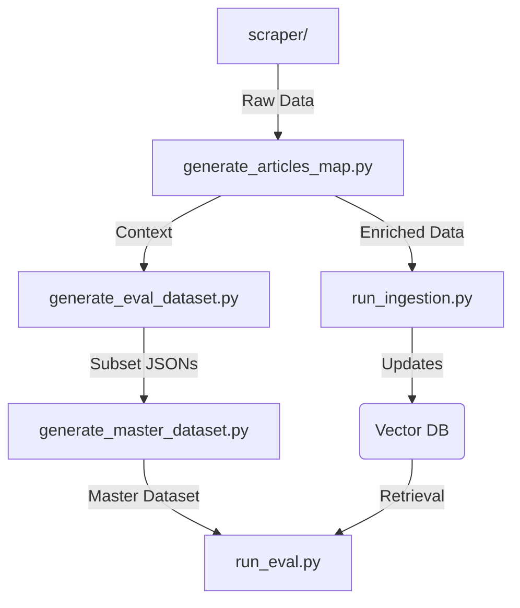

# Backend Scripts

This directory contains the project's core scripts for Data Processing, Evaluation, and Automation.

## 🎯 Scope

- **RAG Pipeline Optimization**: Scripts dealing with Ingestion (Indexing) and Retrieval experiments.
- **Evaluation Loop**: Automation for running RAG evaluations and generating reports.
- **Dataset Management**: Tools for generating, validating, and merging the Master Evaluation Dataset.

## 🗺 Map

| Script Name                  | Description                                                                                                                                             |
| :--------------------------- | :------------------------------------------------------------------------------------------------------------------------------------------------------ |
| `run_eval.py`                | **Evaluation Runner**. The main entry point for running RAG evaluations. Calculates metrics (MAP, Recall, Precision) and generates detailed reports. |
| `run_ingestion.py`           | **Ingestion Runner**. Executes the RAG Indexing process, including Chunking, Embedding, and Upserting to Qdrant.                                     |
| `generate_eval_dataset.py`   | **Question Generator**. Uses LLM Ensemble & Rerank techniques to automatically generate high-quality QA pairs from raw legal texts.                  |
| `generate_master_dataset.py` | **Dataset Merger**. Merges new subset questions into the `master_eval_dataset.json` with deduplication and validation logic.                         |
| `generate_articles_map.py`   | **Utility**. Scans all law JSON files and generates a flat lookup map (`articles_map.json`) of Article ID to Content.                                |
| `scraper/`                   | **Data Collection**. Directory containing scripts for scraping and parsing raw data from external legal sources.                                     |

## 📐 Design Pattern (Pipeline)

The scripts form a cohesive pipeline:

## 🧩 Extension Guidelines

To add a new Script, please adhere to these standards:

1.  **Placement**: Keep scripts in this root directory unless they are part of a larger submodule (like `scraper/`).
2.  **Naming**: Use `snake_case.py`. Start with a verb if possible (e.g., `calculate_metrics.py`).
3.  **CLI Interface**:
    - Use `argparse` or `typer` for argument parsing.
    - Use `kebab-case` for flags (e.g., `--input-file`).
    - Always provide a help description (`-h`).
4.  **Configuration**:
    - Avoid hardcoded paths.
    - Resolve paths relative to `PROJECT_ROOT` or use environment variables.
